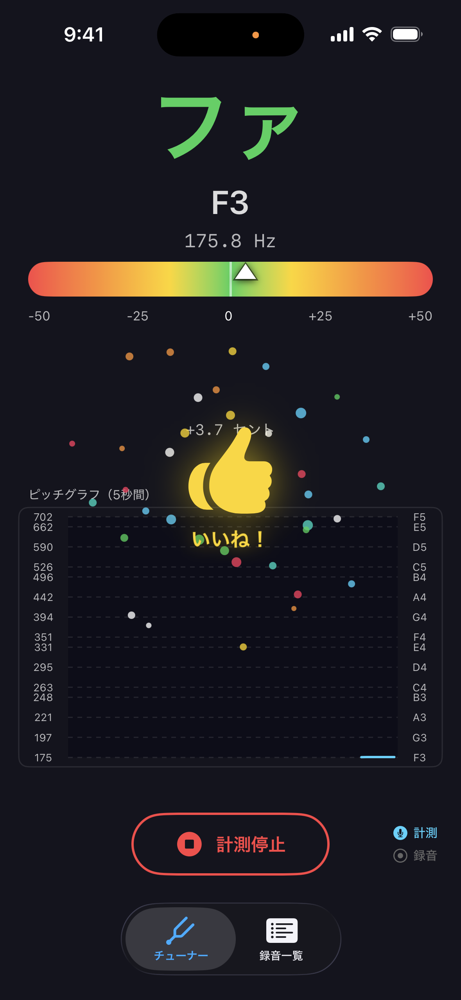
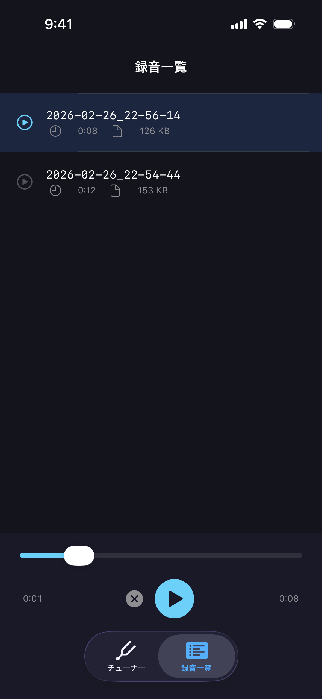

# ぞめきチューナー

篠笛６本調子専用のリアルタイムチューナーアプリ（iOS）

---

## 概要

端末のマイクから音を拾い、ピッチ（Hz）と音階をリアルタイムで表示します。
演奏した音が基準周波数からどれだけズレているかをセント単位で視覚的にフィードバックするほか、演奏を録音・再生する機能も備えています。

- 基準音: **A4 = 442 Hz**（篠笛６本調子）
- 音律: **12平均律**
- 音階名表記: 日本（ドレミファソラシ）と西洋音階名（C D E F G A B）を併記

---

## 主な機能

### チューナー機能
- マイクから音声を取得し、ピッチ（Hz）をリアルタイム計測
- 音階名・周波数を大きく表示
- セントメーターでチューニングのズレを視覚化（±10cent: 緑 / ±25cent: 黄 / それ以上: 赤）
- チューニング成功時のエフェクト表示
- 5秒間のピッチ推移を折れ線グラフで表示（対数スケール・無音時も時間軸が流れる）

### 録音機能
- 計測モード / 録音モードをセグメントで切り替え
  - **計測モード**: ピッチ検出のみ
  - **録音モード**: ピッチ検出 ＋ m4a 録音
- ファイル名は録音開始日時（例: `2026-02-26_21-30-00.m4a`）

### 録音一覧・再生機能
- 保存済みファイルを新しい順に一覧表示
- タップで再生。再生中は下部にコントロールバーを表示
- 再生コントロール: 再生 / 一時停止 / 停止（選択解除）/ シークバー
- スワイプでファイルを削除
- 録音保存後、一覧を自動更新

---

## スクリーンショット

<p align="center">
  
  
</p>

---

## 技術スタック

| カテゴリ | 内容 |
|---|---|
| 言語 | Swift |
| UI フレームワーク | SwiftUI |
| 非同期処理 | Combine |
| 音声入力 | AVFoundation (AVAudioEngine) |
| ピッチ検出 | Accelerate (FFT + HPS) |
| 音声録音 | AVAudioFile (AAC/m4a) |
| 音声再生 | AVAudioEngine + AVAudioPlayerNode |
| 外部ライブラリ | なし |

### ピッチ検出アルゴリズム
- **FFT**（高速フーリエ変換）: Accelerate の `vDSP_fft_zrip` / ハン窓 / FFTサイズ 4096
- **HPS**（倍音積スペクトル法）: 倍音数3で基音を正確に検出
- **放物線補間**: サブビン精度の周波数を算出
- 有効音域: **100 Hz 〜 800 Hz**
- ノイズ判定: RMS < 0.003 で無音とみなす

---

## アーキテクチャ

**MVVM + Clean Architecture**（Presentation / Domain / Data の3層構成）

```
Presentation ──依存──▶ Domain ◀──依存── Data
```

| 層 | 役割 |
|---|---|
| Presentation | View + ViewModel。画面表示と状態管理。Domain のプロトコルにのみ依存 |
| Domain | Model + Repository Protocol + UseCase。ビジネスロジック。外部依存なし |
| Data | DataSource + Repository 実装。AVAudioEngine / FFT などの実装詳細を隠蔽 |

---

## プロジェクト構造

```
shinobuetuner/
├── ShinobuetunerApp.swift
├── Domain/                  # ビジネスロジック（外部依存なし）
│   ├── Model/               # ドメインモデル
│   ├── Repository/          # Repository プロトコル
│   └── UseCase/             # ユースケース
├── Data/                    # AVAudioEngine / FFT などの実装詳細
│   ├── DataSource/          # 音声入出力の低レベル処理
│   └── Repository/          # Repository プロトコルの具体実装
└── Presentation/            # 画面表示と状態管理
    ├── ViewModel/           # ObservableObject
    └── View/
        ├── Turner/          # チューナー画面
        └── Recording/       # 録音一覧・再生画面
```

---

## 動作環境

| 項目 | 内容 |
|---|---|
| iOS | 26.0 以上 |
| Xcode | 26.0 以上 |
| 外部依存 | なし（CocoaPods / Swift Package Manager 不要） |

---

## セットアップ

### Xcode で開発する場合

1. リポジトリをクローン

```bash
git clone https://github.com/seabat/shinobue-tuner-ios.git
```

2. Xcode でプロジェクトを開く

```bash
open shinobue-tuner-ios/shinobuetuner.xcodeproj
```

3. ビルド & 実行

- Xcode でターゲットデバイスを選択してビルド（⌘R）
- マイクの使用許可を求めるダイアログが表示されるので「許可」を選択

### VS Code で開発する場合

#### 必要な拡張機能

`.vscode/extensions.json` に推奨拡張機能が定義されています。プロジェクトを VS Code で開くと自動的にインストールを促すポップアップが表示されます。

| 拡張機能 | 用途 |
|---|---|
| [Swift (swiftlang.swift-lang)](https://marketplace.visualstudio.com/items?itemName=swiftlang.swift-lang) | コード補完・定義ジャンプ・リファクタリング |
| [SweetPad (sweetpad.sweetpad)](https://marketplace.visualstudio.com/items?itemName=sweetpad.sweetpad) | iOS シミュレーターでのビルド・実行・デバッグ |

#### 初回セットアップ

```bash
# 依存ツールのインストール
brew install xcode-build-server xcbeautify

# SourceKit-LSP 用の設定ファイルを生成（プロジェクトルートで実行）
xcode-build-server config -project shinobuetuner.xcodeproj -scheme shinobuetuner
```

#### ビルド & 実行

- `Cmd + Shift + B` — ビルド（`Debug`）
- `Cmd + Shift + P` → `SweetPad: Launch App` — シミュレーターで起動

---

## ライセンス

MIT License